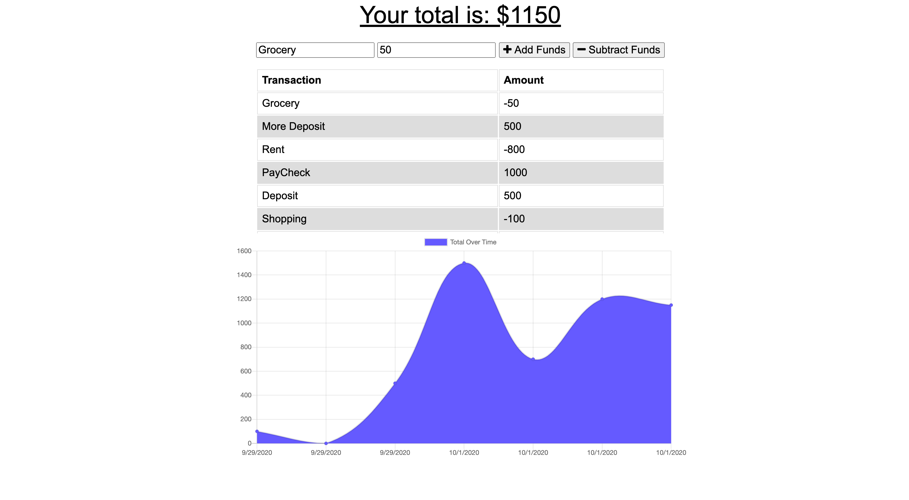

#  Progressive Web Apps

## Overview

* This application makes use of Node.js / Express.js,MONGODB and concepts of Progressive web apps( Indexdb, service workers, cache, web manifest) on the backend and HTML/CSS on the front end. This budget tracker application is designed to work in offline mode.

* The great thing about the application is that the user can add the transactions even when the app is offline. Once the app is online the app will be updated with the new transactions that were added while offline.

* Giving users a fast and easy way to track their money is important, but allowing them to access that information anytime is even more important. Having offline functionality is paramount to our applications success.

## Deployed Version
* Click the link to see the application in heroku
https://shrouded-tundra-90873.herokuapp.com/

## Application at Glance

